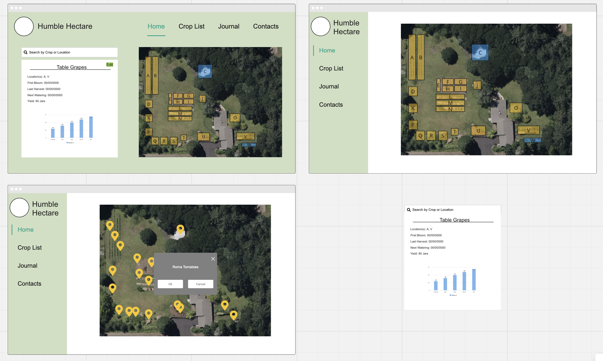

# _Humble Hectare Manager_

#### By _Seth Gonzales_

#### _Full stack application. C# / ASP.NET Core MVC backend using Entity Framework Core and MySQL. React with JavaScript frontend._

## Description

This is a full stack application built for the Humble Hectare in Corvallis, OR. The purpose of this application is to help in storing and visualizing data for yearly land management and crop processing. There was a need for data to be centrally located, efficient to record, and easy to visualize. This application aims to satisfy these needs and contribute to the success of the Humble Hectare.

## Developer Log

As a developer, my aim is to log my journey in building this application. This acts not only as a reference for myself, but as a demonstration of the creative process involved with such an endeavor.

### 1/18/24

- First day working on the HH Manager! I started by reiterating through the needs brought up through conversations with the owners of the HH. I built wire frames of potential designs of the application and mapped out database relationships. 
    - Idea: Upload an image of the property, create Regions and tag them on the image like you would a map. When you click on a Region, see the crops/varietals, as well as any related or tagged logging events.

- Looked through the notes I had for the purposes of HH data tracking to see how I could translate these into database relationships.
    - Identified the key information HH needed to record and how I could visualize that data.
- Following the relationships, I now have the following models.
    - Crops
        - Varietals
            - Events
            - Hectare Log Varietals
                - Hectare Logs
                    - Compost Events
            - Varietal Regions
                - Regions

### 2/21/24

- Started playing around with different database ideas.
- Went through the install process for Feathers.js along with sequelize and postgres. These setups were doing too much and required a lot of additional setup to use.
- Going forward, I will be using a different kind of database

### 2/22/24

- Restarted the database process using MySQL.
- Went through the documentation for setting up this database and creating the relationships I have planned out.
- Finished adding Crop and Varietal models. Tested with hard-coded data and using Swagger.

### 2/29/24

- Fixed a bug with JSON data serialization
- Tested all current crop and varietal endpoints for success.
    - Can now pull a list of related varietals for a crop, as well as full CRUD for varietals.

### 3/1/24

- Created the initial README for the overall project (API and Frontend specific to come later)

### 3/7/24

- Created the model and corresponding controller for Events. 
- I made a few refactors around where I wanted to store information like WaterEvery and FertilizeEvery. Originally I had these stored within events, but I ultimately decided these are best as properties of a crop varietal. 
- I added a front end! At first I used create react app, and started building using Ionic UI. But honestly, I wanted to challenge myself with a newer framework and a UI library that I haven't used before. So... welcome Vite and Mantine.
- I set up the basics of the app using Mantine, including the header, navbar, and routing system. I tested connecting to the db to make sure I was able to get all of the data I needed for Crops and Varietals using an axios connection. 
- Next up... More UI! I need to really map out the app and create a UI that I am happy with.

### 3/14/24

- After talking to J&B, the app users, I have started creating relational maps for adding attachments for events. 
- Created a data table for showing varietals for each crop. Crops are in accordions.
- Decided on some styling... Chose a logo and header color.
- Started working on the Crop modal for Edit and Delete. Need to build out the actual functionality but I spent al ot of time reading through the Mantine docs for their text input tools.

### 3/21/24

- Made a TON of updates today! 
- Now have full CRUD functionality with Crops. Had some fun remembering all of my API endpoints, as well as the syntax for using axois api calls.
- Had a few issues with making sure I was sending the right payload, but I tested with Swagger to double check.
- I incorporated checks for deleting crops and adding duplicates. I feel like I have learned so much from working on VinoSeeker, it is cool to see how it applies here!

### 3/22/24

- Worked on adding the varietal routes today! 
- Updated the react router to include a page for each crop variety we select. 
- I started adding CRUD functionality to varietals and was able to update varietals using the varietal form component. 
- Next time, I want to work on delete and create for varietals, AND I need to work out an issue with the information pulled along with my get requests for each model. I need to limit/include related info being pulled.

### 3/28/24

- Today I made some BIG strides on varietal data being displayed. 
- I ran into some issues with displaying and formatting dates... JS dates have a bad rep! I was able to figure out some of the issues that were going on. Mainly, the dates needed to be reformatted into a string, which would then later need to be reformatted into mm/dd/yyyy. I did a lot of research into different ways to go about this and ended up using toISOString, and then finding some equations for the mm/dd/yyyy reformatting.
- I have watering and fertilizing data formatted into tables. I am not 100% happy with how these look, so I will need to keep thinking about the best way to go about displaying the data.
- ALSO it would be SICK if I could take the water and fertilize schedule and put it into a calendar, so that these values and dates can be seen. I would be REALLY happy about that!
- Going forward, I still need to finish the UD of CRUD for Varietals. I got a bit stuck on UI today, so that got put on the back burner. 

### 4/4/24

- Today I finished full CRUD on varietals! 
- Ran into some issues with some of my functions... Delete and post gave me a bit of a hard time. But ultimately I feel really good about the progress I have made. 
- Next time I want to think more about events and creating logs for the farm. I need to clarify differences between the two in my head again. I have it laid out on Miro, so that will be a big help! 

### 4/25/24

- Big refactor today with the date time formatting functions. I moved these to their own util file to hopefully make them more reuseable for other functions and make the code more modular.
- Began adding in forms for new events. Completed the form but have not completed CRUD functionality. Need to do that next.
- TODO: Install a markdown editor for description and notes text areas. Write a HectareMarkdown wrapper for the text areas.
- TODO: Make model DTOs to reduce data transfers
- TODO: Complete CRUD for events
- TODO: Fix validation for all forms. Need to validate on save and not clear the form.

### 4/30/24

- Played around with creating DTOs today. Made a varietal DTO and applied it to the varietal get. Would like to figure out how to apply this to the crop get included.
- Fixed the bug with data validation! Just had to check through the docs again... Found a silly mistake with my on submit handler.

### 5/5/24

- Made a lot of changes throughout this week! Was able to finish CRUD for events, and now I can start moving on to actual log entries. Lots to add there! 
- TODO: Add every six months to the 'every date' model entry. Create a custom every other? or just a check box for only once, but in this date.  
- TODO: Create Log model, include things like dates, have the log create and store its own date. Figure our how to store weather information... Add attachments to logs. Make it so the log entries show up on a calendar... Make it so events show up on a calendar.
- TODO:  Come up with notifications for crop varietals to show up on the crop list. Look at the next up date vs the current user date. Make the 'next up' dates part of the varietal model.
- TODO: Change the headers for varietal pages... Remove the crop name from the name? Change the formatting for it?

### 5/20/24

- Decided to refactor my components to separate business from front end logic. Pulled out CRUD for crops and loading and updating for varietals. 
- The goal is to follow better practices and make more reusable components/hooks for future use.
- TODO: Finish pulling out CRUD for varietals. 
- TODO: Move on to pulling out CRUD for events.
