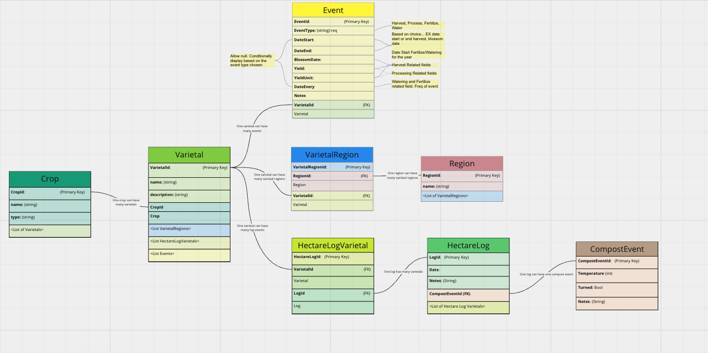

# _Humble Hectare Manager_

#### By _Seth Gonzales_

#### _Full stack application with a C# / ASP.NET Core MVC backend using Entity Framework Core and MySQL, and React frontend._

## Description

This is a full stack application built for the Humble Hectare in Corvallis, OR. The purpose of this application is to help in storing and visualizing data for yearly land management and crop processing. There was a need for data to be centrally located, efficient to record, and easy to visualize. This application aims to satisfy these needs and contribute to the success of the Humble Hectare.

## Developer Log

As a developer, my aim is to log my journey in building this application. This acts not only as a reference for myself, but as a demonstration of the creative process involved with such an endeavor.

### 1/18/24

- First day working on the HH Manager! I started by reiterating through the needs brought up through conversations with the owners of the HH. I built wire frames of potential designs of the application and mapped out database relationships. 
    - Idea: Upload an image of the property, create Regions and tag them on the image like you would a map. When you click on a Region, see the crops/varietals, as well as any related or tagged logging events.

- Looked through the notes I had for the purposes of HH data tracking to see how I could translate these into database relationships.
    - Identified the key information HH needed to record and how I could visualize that data.
- Following the relationships, I now have the following models.
    - Crops
        - Varietals
            - Events
            - Hectare Log Varietals
                - Hectare Logs
                    - Compost Events
            - Varietal Regions
                - Regions

### 2/21/24

- Started playing around with different database ideas.
- Went through the install process for Feathers.js along with sequelize and postgres. These setups were doing too much and required a lot of additional setup to use.
- Going forward, I will be using a different kind of database

### 2/22/24

- Restarted the database process using MySQL.
- Went through the documentation for setting up this database and creating the relationships I have planned out.
- Finished adding Crop and Varietal models. Tested with hard-coded data and using Swagger.

### 2/29/24

- Fixed a bug with JSON data serialization
- Tested all current crop and varietal endpoints for success.
    - Can now pull a list of related varietals for a crop, as well as full CRUD for varietals.

### 3/1/24

- Created the initial README for the overall project (API and Frontend specific to come later)